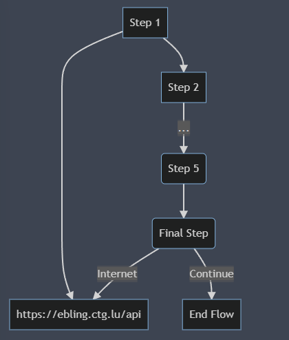
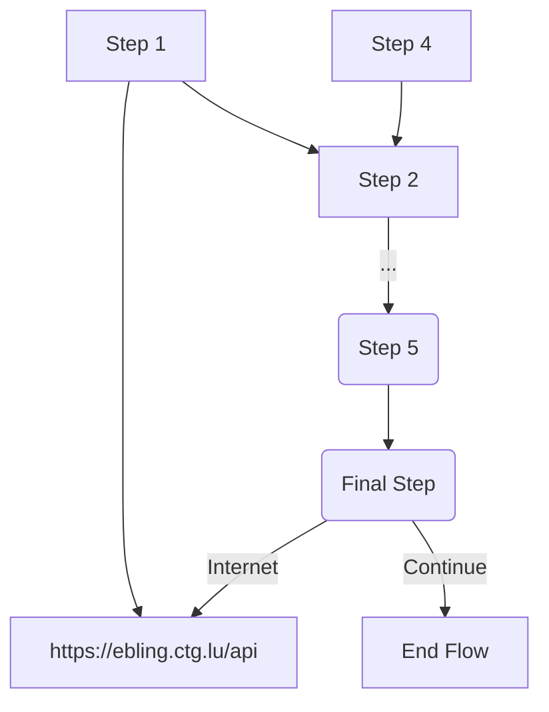

# Ebling

*Ebling provides a central point of reporting, in which each automated flow reports back as a part of its execution.*
*It also features an automated exporter windows and linux binary for workflows that require an external data extraction systems*

 

## Api documentation:

!!! Tip ""
    Interactive API and documentation: <a href="https://ebling.next-in-tech.fr/rapidocs">Api Docs</a>

## Example integration with a standard automation system:

All Automation tools are able to send data through HTTPS using a rest API.

We provide a single API Endpoint to register an Automated workflow, or send data to our backend.

This api then stores the data, and it is displayed within **Trillian** UI.

!!! Tip
    A client is provided for python and javascript to send the requiered data directly to ebling.

Graph source:

